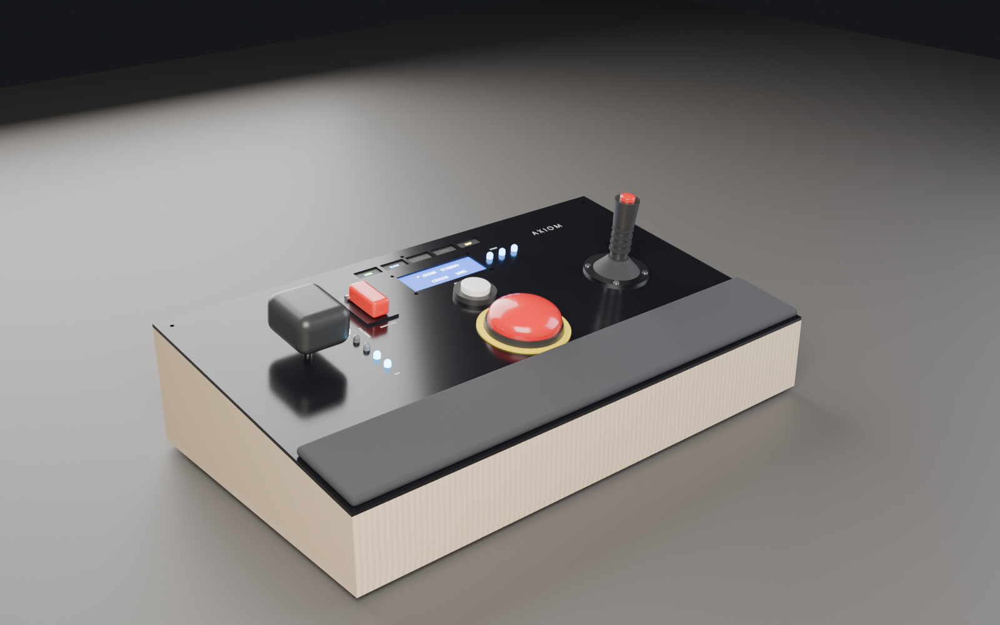
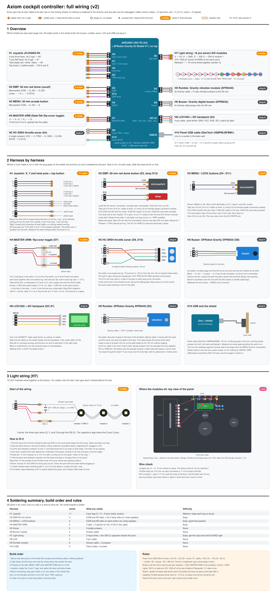

# Cockpit

A custom controller for Axiom: an Arduino Uno in a sloped desk box, 420 × 245 mm. Only one exists, so this is a build
record, not a how-to.

The electronics work on the bench. The enclosure, throttle lever and lights are still to come.

## Controls

| Control | Does |
| --- | --- |
| Stick | Steer. Moves through menus |
| Twist | Rudder |
| FIRE | Guns. Selects in menus |
| Throttle lever | Speed, with cruise in the middle |
| MASTER ARM | Flip cover switch. Nothing fires on SAFE |
| LOCK | Hold to paint up to four targets, release to fire missiles |
| EMP | The big red button. One pulse per life |
| MENU | Pause. Back in menus |

Plus a 16×2 LCD the game draws on, a buzzer and rumble.

## Wiring

| Part | Pin |
| --- | --- |
| Stick X, Y, twist | A0, A1, A2 |
| FIRE, EMP, MENU, LOCK | D2, D3, D4, D11 |
| Rumble | D5 |
| LED string | D6 |
| MASTER ARM | D7 |
| Buzzer | D8 |
| Sonar throttle | D9 trigger, D10 echo |
| EMP lamp | D12 |
| LCD (I²C) | A4, A5 |

## Protocol

USB serial at 115200 baud. ASCII lines, each ending in an XOR checksum (`*HH`).

| Direction | Message | Fields |
| --- | --- | --- |
| To PC, every 20 ms | `AX,x,y,mm,fire,menu,twist,emp,arm,lock*HH` | x, y, twist 0–1023. mm is the throttle distance, -1 for no echo. The rest 0 or 1 |
| To cockpit | `BZ,hz,ms*HH` | Buzzer |
| To cockpit | `LT,row,text*HH` | One LCD row |
| To cockpit | `RM,level,ms*HH` | Rumble, 0–255 |
| To cockpit | `LA,mode*HH` | EMP lamp: off, on or blink |

## Files

| | |
| --- | --- |
| [`AxiomCockpit/`](AxiomCockpit/AxiomCockpit.ino) | Firmware |
| `cockpit/make_cockpit.py` | Builds the Blender model, laser cut panel and mock up template |
| `cockpit/make_wiring.py` | Builds the wiring sheet |
